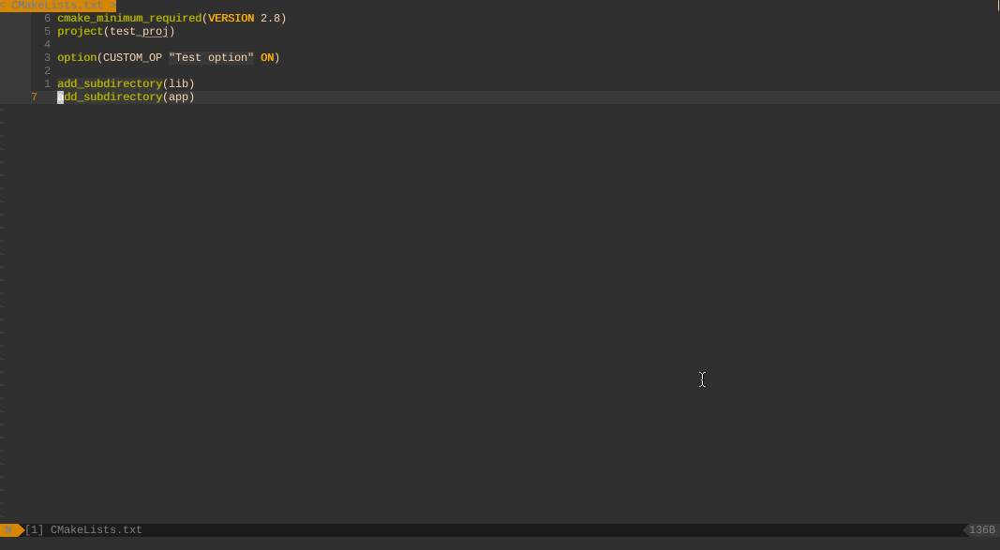
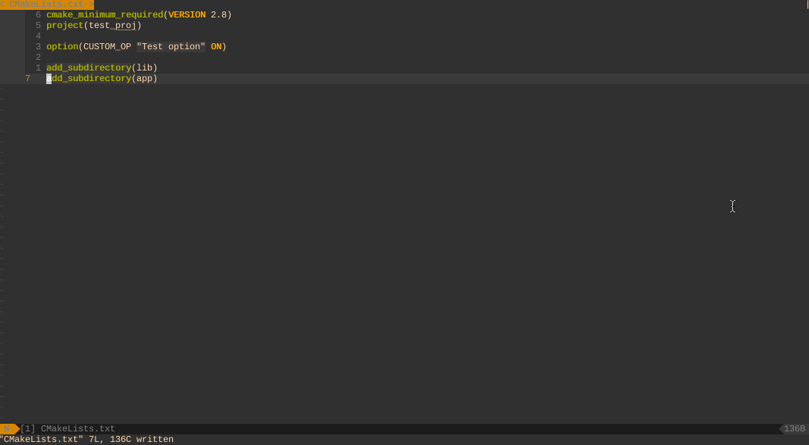

# **cmake4vim**

[](#)
[](#)
[](https://codecov.io/gh/ilyachur/cmake4vim)
[](https://github.com/ilyachur/cmake4vim/blob/master/LICENSE)

I created this plugin in order to improve integration CMake to the Vim editor. I tried different plugins for vim which allow to work with cmake but I didn't find the plugin which was satisfied my requrements.



## Key features

* Written in pure Vimscript
* The plugin supports next CMake Generators:
  * Unix Makefiles
  * Visual Studio
  * Ninja
* The plugin shows cmake results using quickfix list. If you have installed **[vim-dispatch](https://github.com/tpope/vim-dispatch)** plugin, plugin will use it, this means that if you are using vim with tmux, cmake output will be printed in a separate window.
* The plugin allows to specify cmake targets in order to avoid building of all project.
* The plugin has an integration with next fuzzy finder plugins:
   * **[CtrlP](https://github.com/ctrlpvim/ctrlp.vim)**
   * **[FZF](https://github.com/junegunn/fzf.vim)**
* The plugin allows to specify make arguments for native build system (for example *-jN* and something else for Unix Make).
* The plugin parses the output of cmake command and supports jump to warnings or errors.
  

## **Usage**

### **Installation**

You can use VimPlug for installation:
```vim
Plug 'ilyachur/cmake4vim'
```
Or Pathogen:
```sh
cd ~/.vim/bundle
git clone https://github.com/ilyachur/cmake4vim
```

### **Commands**

The current version of the plugin supports next commands:

 - **`:CMake`** creates a build directory (if it is necessary) and generates cmake project.
 - **`:CMakeBuild`** builds current cmake project. The command allows to specify cmake target.
 - **`:CMakeInfo`** creates a window with CMake information.
 - **`:CMakeResetAndReload`** removes cmake cache and re-generates cmake project.
 - **`:CMakeReset`** removes cmake cache (this command removes the cmake build directory).
 - **`:CMakeClean`** cleans the project (it is equal of the execution `make clean`).
 - **`:CMakeSelectTarget`** selects a target for project. You should put target name as a command line argument.
 - **`:CtrlPCMakeTarget`** you can use CtrlP in order to select a target for project.
 - **`:FZFCMakeSelectTarget`** you can use FZF in order to select a target for project.
 - **`:CMakeSelectBuildType`** Change the cmake build type with argument passed and call **`:CMake`**.

### **Variables**

Plugin supports special global variables which are allow to change behaviour of commands (you can change them in your **.vimrc**):

 - **`g:cmake_reload_after_save`** if this variable is not equal 0, plugin will reload CMake project after saving CMake files. Default is 0.
 - **`g:cmake_change_build_command`** if this variable is not equal 0, plugin will change the make command. Default is 1.
 - **`g:cmake_build_dir`** allows to set cmake build directory for all build.  Default is ''. If variable is empty the plugin will use the prefix plus build type.
 - **`g:cmake_build_dir_prefix`** allows to set cmake build directory prefix. Default is 'cmake-build-'.
 - **`g:cmake_build_target`** set the target name for build. Default is empty and default value depends on CMake Generator
 - **`g:make_arguments`** allows to set custom parameters for make command. Default is empty. If variable is empty, plugin launches `make` without arguments.
 - **`g:cmake_project_generator`** allows to set the project generator for build scripts. Default is empty.
 - **`g:cmake_install_prefix`** allows to change **`-DCMAKE_INSTALL_PREFIX`**. Default is empty.
 - **`g:cmake_build_type`** allows to change **`-DCMAKE_BUILD_TYPE`**. Default is empty. If variable is empty, plugin tries to detect cached build type. And selects 'Release' type if cmake cache doesn't exist.
 - **`g:cmake_c_compiler`** allows to change **`-DCMAKE_C_COMPILER`**. Default is empty.
 - **`g:cmake_cxx_compiler`** allows to change **`-DCMAKE_CXX_COMPILER`**. Default is empty.
 - **`g:cmake_usr_args`** allows to set user arguments for cmake. Default is empty.
 - **`g:cmake_compile_commands`** if this variable is not equal 0, plugin will generate compile commands data base. Default is 0.
 - **`g:cmake_compile_commands_link`** set the path for a link on compile_commands.json. Default is empty.

### **Jump to**

Plugin is closely integrated with quickfix list and allows to use quickfix features to jump between error or warning messages.

 - **:cp[revious]** command jumps to previous error/warning message
 - **:cn[ext]** command jumps to next error/warning message

## **Contributing**

Bug reports, feedback, feature and other pull requests are appreciated. Check the [Contributing Guidelines](CONTRIBUTING.md) for how to
create a feature request, submit a pull request or post an issue.

## **References**

### Author

Ilya Churaev ilyachur@gmail.com

### Licence

GPL-3.0
