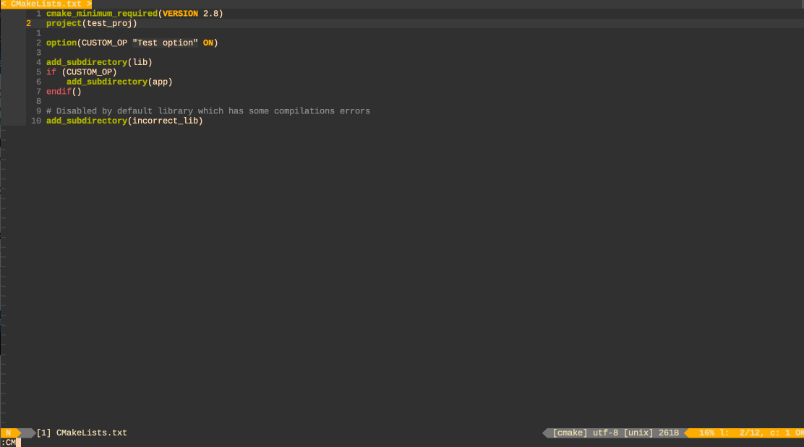

# **cmake4vim**

[](#)
[](#)
[](https://codecov.io/gh/ilyachur/cmake4vim)
[](https://github.com/ilyachur/cmake4vim/blob/master/LICENSE) [](https://gitter.im/cmake4vim/Lobby?utm_source=badge&utm_medium=badge&utm_campaign=pr-badge&utm_content=badge)

I created this plugin in order to improve integration CMake to the Vim editor. I tried different plugins for vim which allow to work with cmake but I didn't find the plugin which was satisfied my requrements.


## Key features

* Written in pure Vimscript
* The plugin supports next CMake Generators:
  * Unix Makefiles
  * Visual Studio
  * Ninja
* The plugin shows cmake results using quickfix list. If you have installed **[vim-dispatch](https://github.com/tpope/vim-dispatch)** plugin, plugin will use it, this means that if you are using vim with tmux, cmake output will be printed in a separate window. In other case plugin will use `jobs` to async run if your Vim editor supports it.
* The plugin allows to specify cmake targets in order to avoid building of all project.
* The plugin has an integration with next fuzzy finder plugins:
   * **[CtrlP](https://github.com/ctrlpvim/ctrlp.vim)**
   * **[FZF](https://github.com/junegunn/fzf.vim)**
* The plugin allows to specify make arguments for native build system (for example *-jN* and something else for Unix Make).
* The plugin parses the output of cmake command and supports jump to warnings or errors.
* Supports work with multiple build types
* For CMake newer than 3.13 the plugin uses the CMake file API
* Plugin allows to find and run executable file for selected target.
* Plugin supports [Vimspector](https://github.com/puremourning/vimspector) plugin. Plugin can generate and modify Vimspector configuration file in order to save command line arguments and allows to debug application.

## **Usage**

### **Installation**

You can use VimPlug for installation:
```vim
Plug 'ilyachur/cmake4vim'
```
Or Pathogen:
```sh
cd ~/.vim/bundle
git clone https://github.com/ilyachur/cmake4vim
```

### **Commands**

The current version of the plugin supports next commands:

#### Basic

 - **`:CMake`** creates a build directory (if it is necessary) and generates cmake project.
 - **`:CMakeResetAndReload`** removes cmake cache and re-generates cmake project.
 - **`:CMakeReset`** removes cmake cache (this command removes the cmake build directory).
 - **`:CMakeBuild`** builds current cmake project. The command allows to specify cmake target.
 - **`:CMakeSelectTarget`** selects a target for project. You should put target name as a command line argument.
 - **`:CMakeSelectBuildType`** changes the cmake build type with argument passed and call **`:CMake`**.
 - **`:CMakeInfo`** creates a window with CMake information.
 - **`:CMakeClean`** cleans the project (it is equal of the execution `make clean`).

#### Execute

 - **`:CMakeRun`** Run the current the binary of currently selected target. Allows to automatically change the [Vimspector](https://github.com/puremourning/vimspector) config file. **Attention! The support of Vimspector config is an experimental feature.**
 - **`:CMakeRun!`** Run the current the binary of currently selected target. Command allows to reset previous arguments if plugin reads arguments from [Vimspector](https://github.com/puremourning/vimspector) config. **Attention! The support of Vimspector config is an experimental feature.**
 - **`:CTest`** run `ctest`. The command allows to specify CTest arguments and default arguments can be set in `g:cmake_ctest_args`
 - **`:CTest!`** same as `:CTest` but ignores `g:cmake_ctest_args`.

#### Integration

 - **`:CCMake`** allow to use *ccmake* command inside vim. The command supports next open modes: 'vsplit' - vertical mode, 'hsplit' - horizontal mode, 'tab' - open ccmake in the new tab (by default the horizontal mode is used).

#### FZF plugins

 - **`:CtrlPCMakeTarget`** you can use CtrlP in order to select a target for project.
 - **`:CtrlPCMakeBuildType`** allows to use CtrlP in order to select a project build type.
 - **`:CtrlPCMakeKit`** uses CtrlP to select a CMake kit for project.
 - **`:FZFCMakeSelectTarget`** you can use FZF in order to select a target for project.
 - **`:FZFCMakeSelectBuildType`** allows to use FZF in order to select a project build type.
 - **`:FZFCMakeSelectKit`** uses FZF to select a CMake kit for project.

## `<Plug>` mappings

| `<Plug>` mapping          | Command                   |
|:--------------------------|:--------------------------|
| `(CMake)`                 | `:CMake`                  |
| `(CMakeResetAndReload)`   | `:CMakeResetAndReload`    |
| `(CMakeReset)`            | `:CMakeReset`             |
| `(CMakeBuild)`            | `:CMakeBuild`             |
| `(CMakeClean)`            | `:CMakeClean`             |
| `(CMakeInfo)`             | `:CMakeInfo`              |
| `(CMakeRun)`              | `:CMakeRun`               |
| `(CTest)`                 | `:CTest`                  |
| `(CCMake)`                | `:CCMake`                 |

### **Variables**

Plugin supports special global variables which are allow to change behaviour of commands (you can change them in your **.vimrc**):

#### Common

The options below allow to change plugin behavior.

 - **`g:cmake_executable`** the path to CMake. Default is 'cmake'.
 - **`g:cmake_reload_after_save`** if this variable is not equal 0, plugin will reload CMake project after saving CMake files. Default is 0.
 - **`g:cmake_change_build_command`** if this variable is not equal 0, plugin will change the make command. Default is 1.
 - **`g:cmake_compile_commands`** if this variable is not equal 0, plugin will generate compile commands data base. Default is 0.
 - **`g:cmake_compile_commands_link`** set the path for a link on compile_commands.json. Default is empty.
 - **`g:cmake_vimspector_support`** enables generation and modification of [Vimspector](https://github.com/puremourning/vimspector) config file. Default is 0. **Attention! The support of Vimspector config is an experimental feature.**
 - **`g:cmake_build_executor`** allows to force set the build executor. Available values are 'job', 'dispatch', 'system' and ''. Default is empty.

#### Build path

Below the list of options which allow to customize the path to CMake build directory. The list order is from higher to lower priority (it means if you initialize several options plugin will use the first initialized option from the list):

 - **`g:cmake_build_dir`** allows to set cmake build directory.  Default is ''. If variable is empty the plugin will use the prefix plus build type.
 - **`g:cmake_build_path_pattern`** pattern for build dir, two strings that will be evaluated in a `printf`. e.g.:
     `let g:cmake_build_path_pattern = [ "%s/workspace/build/%s/%s/%s", "$HOME, fnamemodify( getcwd(), ':t' ), g:cmake_selected_kit, g:cmake_build_type" ]`
 - **`g:cmake_build_dir_prefix`** allows to set cmake build directory prefix, in this case the plugin uses the next rule to generate build directory name: `g:cmake_build_dir_prefix` + `g:cmake_build_type`. This option is used by default, the default prefix is 'cmake-build-'.

#### CMake build options

The list contains variables which allow to configure CMake build.

 - **`g:cmake_src_dir`** allows to set cmake source directory.  Default is '' which evaluates to the current working directory.
 - **`g:cmake_build_type`** allows to change **`-DCMAKE_BUILD_TYPE`**. Default is empty. If variable is empty, plugin tries to detect cached build type. And selects 'Release' type if cmake cache doesn't exist.
 - **`g:cmake_variants`** enables predefined cmake build variants in the form of a dictionary, e.g. `{ 'Debug' : { 'cmake_build_type' : 'Debug', 'cmake_usr_args' : { 'CONAN_PATH' : '~/.conan' } }`
 - **`g:cmake_build_target`** set the target name for build. Default is empty and default value depends on CMake Generator
 - **`g:cmake_usr_args`** allows to set user arguments for cmake. Default is empty. It can be either a string or a dictionary.
 - **`g:make_arguments`** allows to set custom parameters for make command. Default is empty. If variable is empty, plugin launches `make` without arguments.
 - **`g:cmake_ctest_args`** enables arguments for `ctest`, e.g. `'-j8 --output-on-failure --verbose'`. Default is empty. If the user calls `:CTest <some arguments>`, the `g:cmake_ctest_args` are inserted directly after `ctest`, before the `<some arguments>` parameter.
 - **`g:cmake_kits`** enables predefined cmake kits in the form of a dictionary of dictionaries that specify a toolchain file, environment variables, cmake variables among other things
 - **`g:cmake_selected_kit`** currently selected cmake kit. Default is empty.


#### Deprecated options

**These options were deprecated and will be removed at the beginning of 2022 year.**

 - **`g:cmake_project_generator`** allows to set the project generator for build scripts. **The option was deprecated, please use `let g:cmake_usr_args='-G<Generator>'` instead.** Default is empty.
 - **`g:cmake_install_prefix`** allows to change **`-DCMAKE_INSTALL_PREFIX`**. **The option was deprecated, please use `let g:cmake_usr_args='-DCMAKE_INSTALL_PREFIX=<prefix>'` instead.** Default is empty.
 - **`g:cmake_c_compiler`** allows to change **`-DCMAKE_C_COMPILER`**. **The option was deprecated, please use `let g:cmake_usr_args='-DCMAKE_C_COMPILER=<compiler>'` instead.** Default is empty.
 - **`g:cmake_cxx_compiler`** allows to change **`-DCMAKE_CXX_COMPILER`**. **The option was deprecated, please use `let g:cmake_usr_args='-DCMAKE_CXX_COMPILER=<compiler>'` instead.** Default is empty.
 - **`g:cmake_toolchain_file`** currently selected toolchain file. **The option was deprecated, please use `let g:cmake_usr_args='-DCMAKE_TOOLCHAIN_FILE=<file>'` instead.** Default is empty.

#### Examples

Example of supported functions in `g:cmake_kits`:
```
let g:cmake_kits = {
            \  "android-ndk-r22": {
            \    "toolchain_file": "~/toolchains/android.cmake",
            \    "environment_variables": {
            \      "PATH_TO_CACHE": "/Users/vimmer/cache",
            \      "PATH_TO_CONFIG": "/Users/vimmer/config"
            \    },
            \    "cmake_usr_args": {
            \      "USE_BROWSER": "chrome",
            \      "TIMEOUT_IN_SECONDS": "300"
            \    },
            \    "generator": "Ninja"
            \  } }
let g:cmake_kits = {
            \  "gcc": {
            \    "compilers": {
            \        "C": "/usr/bin/gcc",
            \        "CXX": "/usr/bin/g++"
            \  } }
```

If you specify both `toolchain_file` and `compilers`, the `toolchain_file` takes precedence and `compilers` are ignored.

### **Jump to**

Plugin is closely integrated with quickfix list and allows to use quickfix features to jump between error or warning messages.

 - **:cp[revious]** command jumps to previous error/warning message
 - **:cn[ext]**     command jumps to next     error/warning message

## Demos

* CMakeInfo window:

* Select build type

* Jump to cmake error:

* Ninja compilation error


## **Contributing**

Bug reports, feedback, feature and other pull requests are appreciated. Check the [Contributing Guidelines](CONTRIBUTING.md) for how to
create a feature request, submit a pull request or post an issue.

## **Tips and tricks**

### Open shell in the build directory

```
nnoremap <expr> <leader>db printf(":bo new\<CR>:lcd %s\<CR>:res 15\<CR>:term ++curwin\<CR>", utils#cmake#getBuildDir() )
```

### YouCompleteMe

If you're using `YouCompleteMe` and want `clangd-completer` to work with different compilers, you could pass `clangd` a `-query-driver` argument.

E.g. for developing `emscripten`, you could pass `em++` to `clangd` via `g:ycm_clangd_args`.

You could add such entries to your `g:cmake_kits` and override `CMakeSelectKit` and `FZFCMakeSelectKit`.

Add this to the `after` directory, e.g. `~/.vim/after/plugin/cmake.vim`:
```
function! s:customSelectKit(name) abort
    if !has_key( g:cmake_kits, a:name )
        echom printf("CMake kit '%s' not found", a:name)
        return
    endif

    call cmake4vim#SelectKit(a:name)

    let l:cmake_kit = g:cmake_kits[ g:cmake_selected_kit ]
    let g:ycm_clangd_args = filter( g:ycm_clangd_args, "v:val !~# 'query-driver'" )
    if has_key( l:cmake_kit, 'query_driver' )
        let g:ycm_clangd_args += [ printf( '-query-driver=%s', l:cmake_kit[ 'query_driver' ] ) ]
        YcmRestartServer
    endif
endfunction

function! s:FZFSelectKit() abort
    if exists(':FZF')
        return fzf#run({
                    \ 'source': sort( keys( g:cmake_kits ), 'i' ),
                    \ 'options': '+m -n 1 --prompt CMakeKit\>\ ',
                    \ 'down':    '30%',
                    \ 'sink':    function('s:customSelectKit')})
    endif
endfunction

command! -nargs=1 -complete=custom,cmake4vim#CompleteKit CMakeSelectKit    call s:customSelectKit(<f-args>)
command!                                                 FZFCMakeSelectKit call s:FZFSelectKit()
```

## **References**

### Author

Ilya Churaev ilyachur@gmail.com

### Licence

GPL-3.0
